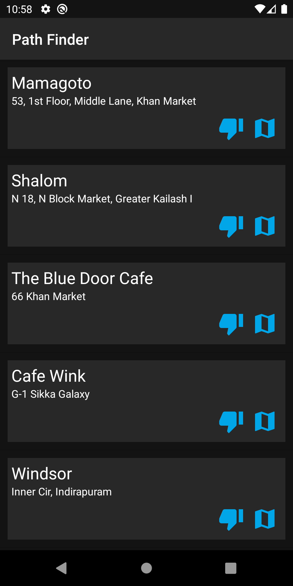

# KotlinWithCoroutines


In this project, you will get a basic idea of how we can use kotlin, retrofit view models and coroutines for the network call, I used FourSquare Places API to get the list of nearby restaurants data. 


## Screenshots

[](screenshots/screenshot1.png)

## How to use it?
Clone this repository and import into **Android Studio**
```bash
git clone https://github.com/DeepakChhipa1999/kotlinproject.git
```

## Permissions
The App requires the following permissions:
- Internet access.

##Tech Specification
- [Retrofit](https://square.github.io/retrofit/)
- [Glide](https://github.com/bumptech/glide)
- [Gson](https://github.com/google/gson)
- [RecyclerView](https://developer.android.com/jetpack/androidx/releases/recyclerview)


### Contributing
Just make pull request. You are in!